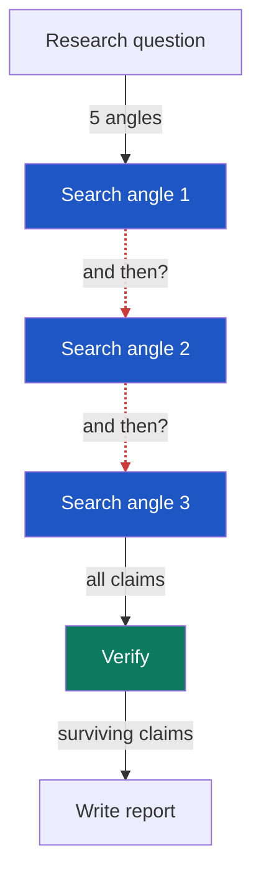
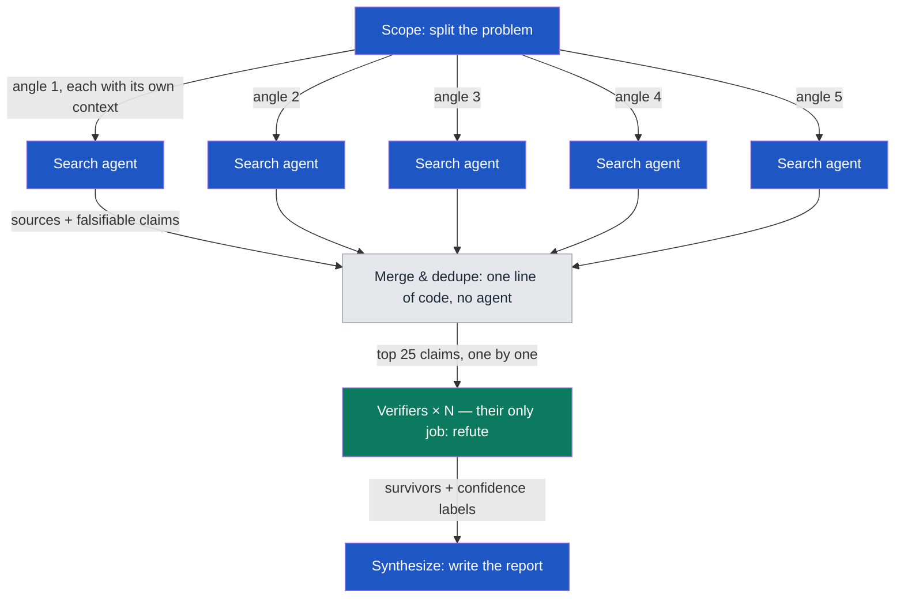
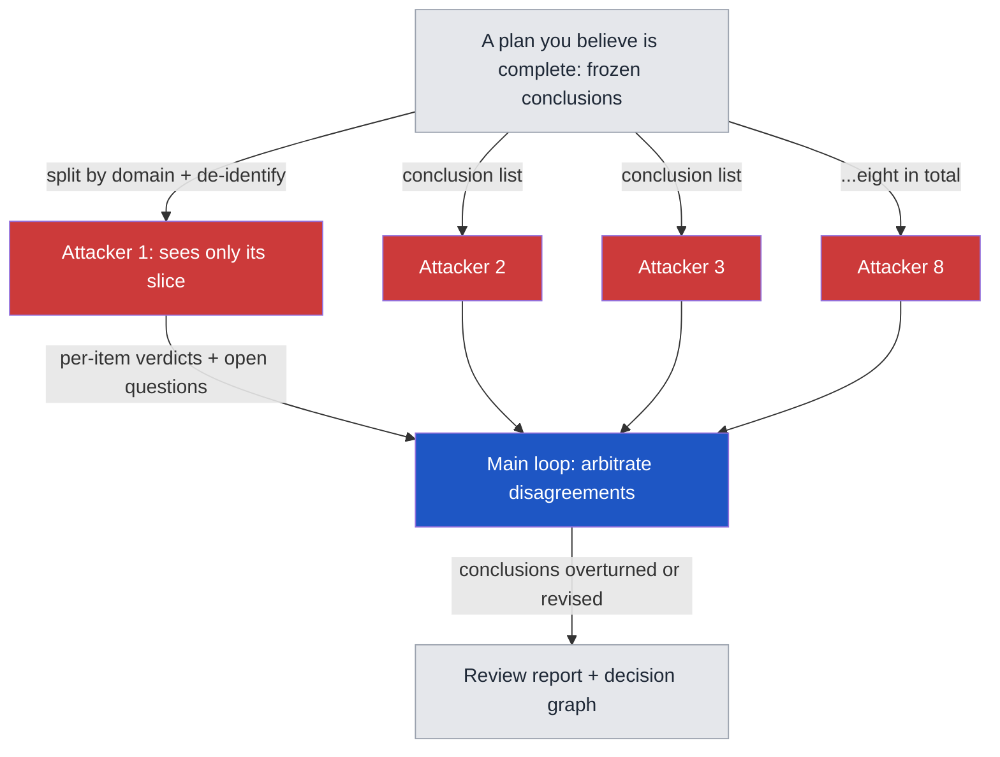

# Graph Engineering: The Art of Making Your Agents Fight Each Other

*The term that blew up right after Loop Engineering. I happened to run a 313-agent product research sprint with it the week before. The templates this piece describes live in [prompts/](prompts/).*

> Published as a [LinkedIn article](https://www.linkedin.com/pulse/graph-engineering-art-making-your-agents-fight-each-other-david-tseng-mc5lc/) on 2026-07-30; this is the source copy. Traditional Chinese original: [Graph Engineering 的 Agent 左右互搏之術](https://davidyctseng.substack.com/p/agents).

Graph Engineering turns your AI agents from a waiting line into a graph that fires in parallel. The week before the term took off, I had just finished three rounds of product market research with the same method — 313 agents in total — and the results were honestly better than I expected. Learn to run a graph, or just copy the prompts in this repo, and you'll never worry about unused tokens again. (That's a joke. Mostly.)

The part that surprised me most: almost every trick in this method already has a name in the research-methods literature, and every name is older than I am. We're not inventing anything. We're relearning how to apply old discipline with new, cheap labor. This piece is about what survived the field test.

## Prompt → Context → Harness → Loop → Graph

Loop Engineering is one agent cycling: observe → decide → act → verify → retry, over and over. For simple tasks that's all you need. But complex, multi-step work that needs parallelism or strict verification will break a single loop — it mixes up facts, misses contradictions, and burns tokens for nothing.

Graph Engineering coordinates multiple loops with an explicit graph structure. Three parts:

- Node: a bounded unit of work. In practice, a freshly dispatched agent (a subagent, or a separate session)
- Edge: an actual flow of data
- State: the context that travels along the edges

So graphs don't replace loops. They connect and govern them. Your setup evolves from one loop into something that looks like a company org chart — colleagues working in parallel, handing each other real work products.

## The most common waste in a loop

Most people write agentic flows as "do A, then B, then C." Most of those "then"s are unnecessary — the next step never reads the previous step's output. The order exists only because that's how you typed it, or how you're used to working. These are called false edges, and every false edge is a wait with no reason behind it.

There is exactly one test: at planning time, can you name the data or context flowing along the arrow? If yes, the edge is real. If not, the two steps are independent — they can run at the same time. One more saving: if a step can be handled by one line of code, don't spend an agent on it.

Agents are for reasoning and judgment, not for routine plumbing.

## Don't reach for a graph yet

What belongs on a graph? Complex research is a born candidate: competitor research, market research, new-technology scans, cross-border tax questions. My field test was new-product market research. Development workflows qualify too — Product Research, Coding, Review/Testing are each a node, and what flows between them is a spec, a diff, and a test report. Your team's normal dev process is already a graph made of people.

The reverse also holds: simple tasks should stay on Context + Loop. Upgrade to a graph when the task shows these traits:

- Needs multiple kinds of expertise
- Needs parallelism
- Needs a strict evidence chain
- Needs long memory, and the ability to resume after interruption

No traits, no graph. Opening one anyway is over-engineering — cost and complexity jump a tier, and quality may not move at all.

## The 313-agent field test

My three research rounds all used the same skeleton. I call it the diamond: one node splits the problem, a crowd of nodes works in parallel, one node closes.

1. Split the research question into 5 search angles
2. 5 agents search in parallel, each reading its own sources
3. Pull back 20-some sources, extract falsifiable claims
4. For every claim, 3 agents vote: kill it or keep it
5. One final agent writes the report

Here's one claim walking the full path. A competitor-research agent brings back "some open-source tool charges per seat," with a source attached, tagged as falsifiable. After dedupe it enters the verification pool. Three verifiers split up — one reads the official pricing page, one hunts for an independent second source, one traces the original citation. Result: the tool doesn't charge per seat at all. The source was a stale community comparison post. Two votes against, the claim dies, and a one-line rejection goes into the ledger. No human touched any of it.

Across three rounds: 313 agents (each an independent session), about 13 million subagent tokens, 332 claims, 75 into verification. A single chat session can't hold 20 sources open at once — the context window won't take it. But each agent carries only its own share, and comes back with only its conclusion. That is the breadth a graph buys.

## Errors don't survive three skeptics

Find what you don't know, plus what you can actually trust.

The most valuable part of the field test wasn't the parallelism. It was verification through mass argument. My three rounds had claim rejection rates of 16%, 40%, and 28%. Without adversarial verification, here's what I would have been quoting:

- A lab spends $1B a year buying RL environments — killed as media hearsay. **That kill was right for the wrong reason, and I only found out by running template 03 on this article.** The report exists: The Information, September 2025, relayed by TechCrunch with a link. What is actually wrong is the quantity — leaders had *discussed* spending *more than* $1B *over the next year*: a forward-looking floor, not an annual run-rate for buying. A verifier that can't tell "unsourced" from "sourced to a paywalled outlet I didn't open" will kill true claims too, and this is what that looks like.
- A startup grew revenue 15x in a year — self-reported, no independent source. Killed.
- The EU AI Act's high-risk obligations take effect August 2026 — amended, pushed to December 2027. Killed.

An agent never grades its own homework, and two verifiers never ask the same question. A 40% rejection rate means nearly half of the public data in my field can't survive three skeptics.

## Dedupe against everything you've seen

Dedupe has to run against everything you've seen — not just what you kept. A rejected claim that leaves no trace gets rediscovered next round, re-evaluated, and re-killed. You pay rent on the same dead end forever. The fix: when a claim dies, record it anyway, with one line of reason and how it was checked.

In my experience, agents love to "discover a second problem along the way," and it's usually a duplicate. A loop-style ledger reads the entire file into context every round just to check for repeats. After switching to the graph structure, lookup cost dropped about 12x. The graph mindset makes you faster, and it also makes you see exactly where you've been paying rent for nothing. From where I sit, loop-to-graph isn't a preference. It's the obvious next optimization.

## Mass-attack what you already know

Find what you think you know that's actually wrong.

A graph can explore the unknown. It can also run backwards: attack the known.

I took a planning document that matters a lot to me — revised three times by hand, and I believed it was solid. I split it into 8 domains and dispatched 8 agents. Each one got only de-identified facts and its own slice of the conclusion list. By design, none of them could see the full document, or each other. The instruction was one sentence: overturn our conclusions.

One round later, about a fifth of the conclusions were overturned or corrected. The single biggest number had been overstated almost 5x. Three rounds of my own edits never caught it — the same story as a bug you can't fix because you keep debugging it with the same eyes. When an agent iterates on its own work, wrong assumptions reinforce themselves. Isolated skeptics carry no such baggage.

What I learned collating the attacks:

- Isolation cuts both ways. It buys independence, and it buys noise — the collation pass has to filter line by line
- The best finds all came from the open question. Item-by-item checks produce corrections; "what risk have we completely missed?" — the premortem question — produces reversals
- Don't outsource arithmetic. Math is plumbing. Keep it in the main loop
- One model, copied, is one blind spot, copied. Software engineering proved this in 1986: independently written programs still make correlated errors. The fix is a counter-examiner from another family — Claude, Codex, Gemini, Grok, crossed. Two hands sparring fast are still driven by one brain. A real fight needs someone else's hands

## A 70-year-old playbook

This is my favorite part. After writing the section above, I went back to check where these tricks came from. Almost every one has a name, and every name predates LLMs by decades:

- Isolated skeptics — the Delphi method (RAND, 1950s): experts answer independently and never meet. The reason got confirmed by experiment later: social influence wrecks the accuracy of group judgment
- Designated attack — Devil's Advocacy, 1970s management science. The finding: structured attack exposes hidden assumptions better than expert consensus does
- The open question — the Premortem (Gary Klein, 2007): "assume the plan has already failed — why?" The lab result behind it is thinner than it usually gets quoted as being: the 1989 study Klein cites measured how many *reasons* people generated, not how many risks they caught, and never checked whether the reasons were right
- The rejection ledger — Analysis of Competing Hypotheses (CIA): items considered and set aside stay on a written list, and a hypothesis is retired by being disproved rather than by being unproven. The official standard for labeling confidence is a different document — ODNI's ICD 203, Analytic Standards (2015) — which sets likelihood bands and forbids putting a confidence level and a likelihood in the same sentence

The LLM world has parallel findings. AI Safety via Debate (2018) argued that models attacking each other gets closer to truth than models grading themselves. Anthropic published the engineering story of their own multi-agent research system in 2025 — same conclusion: multi-agent wins clearly on breadth, at ten-something times the token cost.

There's also a counter-camp. Since 2024, a line of research argues that the gains from multi-agent debate are sometimes just more compute, not more perspectives — the same budget spent on more samples from a single model does about as well. That criticism targets debate-to-consensus architectures; independent attackers with human arbitration sit outside its range. Still worth knowing.

The method is old. What's new is the price: convening eight experts who never meet went from weeks to under an hour.

## The ceiling

The graph buys breadth, not judgment.

A concrete case. Two questions in my research — why do small teams actually pay, and how do enterprises prepare for compliance purchasing — returned zero surviving claims, round after round. Guess why. It wasn't too few agents. The answer isn't in public data. A hundred more agents return the same nothing.

A graph amplifies your search. It doesn't replace going to meet people. Once the research converges, the next step is field interviews, or collecting data points nobody else has. That's the node you can't draw.

## The graph outputs faster than you can absorb

The other ceiling is human. Eight agents produce more in one night than I can internalize in a week. Documents used to be written for traceability; now every conclusion carries its source, its confidence label, its correction history. For the next round of agents, and for expert readers, that's an asset. For a human who hasn't digested it yet, it's a wall. I couldn't read my own reports.

I'm still experimenting here, but I believe the fix is not simplification — it's adding a layer. Keep the dense text as is, and put a three-minute entry page on top, arranged the way a human actually learns: where things stand, what decision is pending, what to do this week, which file to open if you want depth. Leave the density to AI and experts. Design the simple entrance for yourself. If you've ever built a personal LLM wiki, this will feel familiar.

Breadth sends the bill. Attention pays it.

## Tuition

This round's tuition, honestly itemized. One: I never tiered the models. Three hundred agents all ran on the most expensive one, when search and fetch are repetitive work a cheap model handles fine. Judgment belongs in verification and synthesis — that's where the good model goes. Two: I built a graph that worked and didn't save it. Only after the run did it hit me that the same skeleton with different prompts covers completely different jobs. This repo is the fix — model tiers included, attack mode written in as a template. Next time I shouldn't have to reinvent it. Probably.

Where Graph Engineering goes next as a term, I don't know. My guess is it keeps drifting toward the operating flow of an actual company. What I can promise: draw the graph first, fire in parallel, and your tokens will burn magnificently.

The templates are one directory over: start with [00 Your First Graph](prompts/00-first-graph.md) — one claim you believe, three isolated skeptics, one vote, five minutes. A transcript of a real run is in [examples/00-first-graph-run.md](examples/00-first-graph-run.md), where a marketing number that's been quoted for five years got killed 3–0 in ninety seconds. Watch it kill a number you've probably cited yourself, then decide whether to copy it.

## Sources

- Graph Engineering con Opus 5 (@angeldot_, 2026-07-25)
- Graph Engineering Clearly Explained (@akshay_pachaar, 2026-07-25)
- Graph Engineering: 从 0 到 1 小白完整教程 (@AdrianPunk115, 2026-07-26)
- Gary Klein, Performing a Project Premortem (Harvard Business Review, 2007)
- Knight & Leveson, An Experimental Evaluation of the Assumption of Independence in Multiversion Programming (1986)
- Richards Heuer, Psychology of Intelligence Analysis (CIA, 1999)
- ODNI, Intelligence Community Directive 203: Analytic Standards (signed 2 January 2015)
- Mitchell, Russo & Pennington, Back to the future: Temporal perspective in the explanation of events (Journal of Behavioral Decision Making, 1989) — the study behind Klein's premortem figure
- Irving, Christiano & Amodei, AI Safety via Debate (2018)
- Chen et al., Are More LLM Calls All You Need? Towards Scaling Laws of Compound Inference Systems (2024)
- Anthropic, How we built our multi-agent research system (2025)
