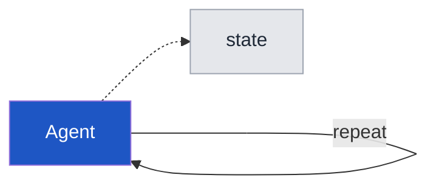
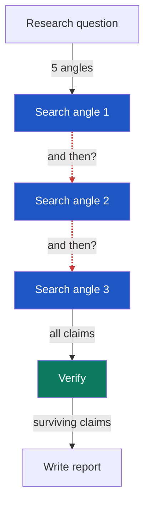
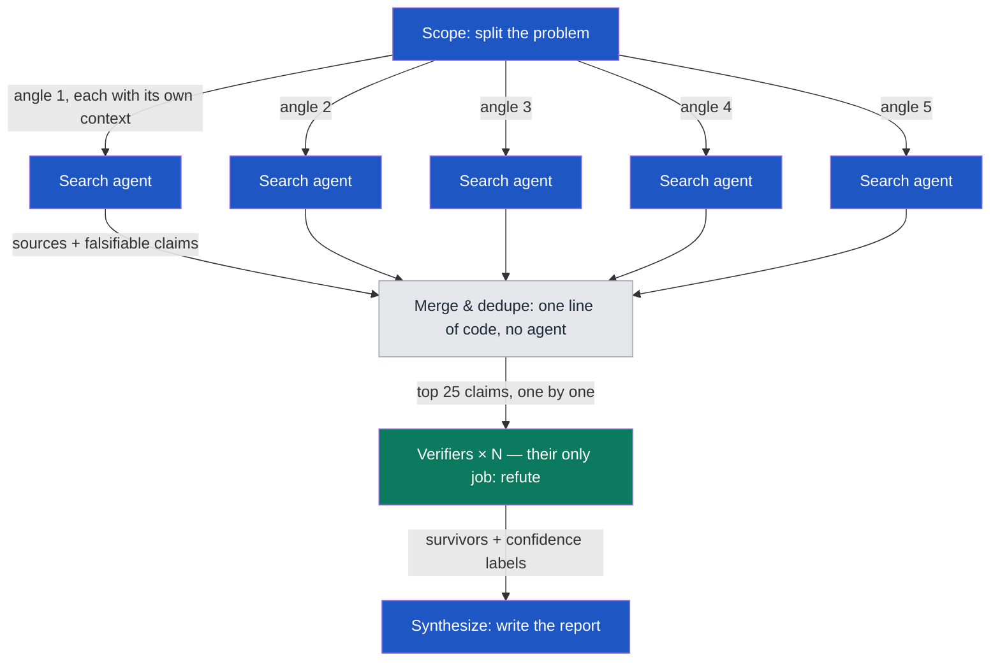
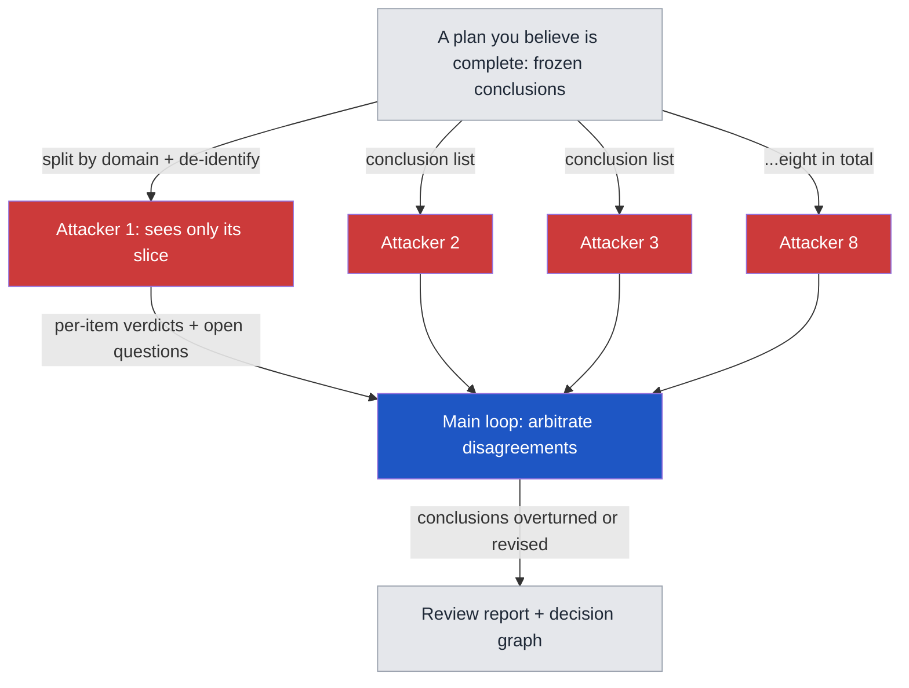
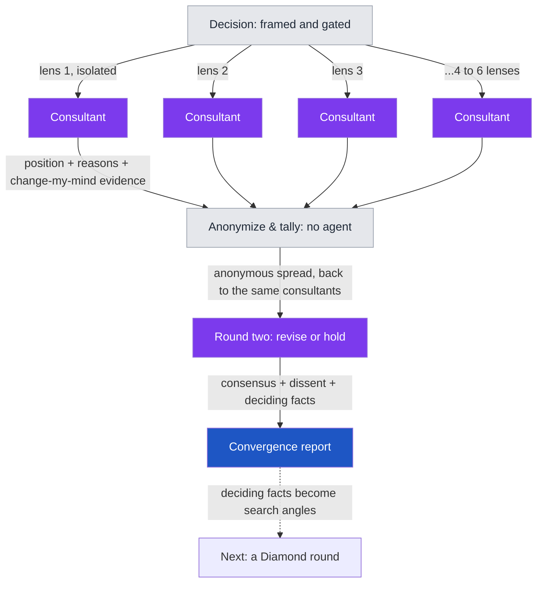

# Graph Engineering Sample Prompts

English ｜ [繁體中文](README.zh-TW.md)

Copy-paste prompts that turn your AI agents from a waiting line into a graph that fires in parallel — then flip the graph around and attack your own conclusions.

Five templates plus a five-minute demo, five diagrams. Every file is self-contained: copy the whole block, paste it to your agent, type your topic at the bottom, send.

**Or skip the copy-paste entirely:** [install as a Claude Code plugin](#install-as-a-claude-code-plugin) and every template becomes a slash command — `/diamond-research your topic`.

| Template | What it does | When to use it |
|---|---|---|
| [00 Your First Graph](prompts/00-first-graph.md) | One claim you believe, three isolated skeptics, one vote — the diamond's kill layer alone | Feeling the method in five minutes, before learning it |
| [01 False-Edge Audit](prompts/01-false-edge-audit.md) | Lays out your existing workflow and finds which "and then"s are fake | You suspect your agents are waiting in a line they don't need |
| [02 Diamond Research](prompts/02-diamond-research.md) | Split into angles → parallel search → adversarial verification → report with confidence labels | Researching an unknown territory (market, competitors, regulation) |
| [03 Adversarial Review](prompts/03-adversarial-review.md) | Feeds your finished conclusions to isolated attackers | A document that matters, that you've revised many times, that you believe is complete |
| [04 Consultant Roundtable](prompts/04-consultant-roundtable.md) | Two-round Delphi: isolated consultants take positions → anonymous aggregate → revise or hold → consensus map with dissent kept | A decision with no right answer in public data (pricing, timing, build vs buy) |
| [05 Issue Tree](prompts/05-issue-tree.md) | MECE decomposition into a dispatchable tree — and then actually dispatches it: fact leaves to 02, judgment leaves to 04 | A big fuzzy problem, before any research is dispatched |

Want proof before pasting anything? Every run below is a verbatim transcript, published with what went wrong left in:

- [00, a real run](examples/00-first-graph-run.md) — the README's own example claim, three isolated skeptics, killed 3–0 in ninety seconds
- [02, a real run](examples/02-diamond-research-run.md) — 31 agents pointed at this repo's own premise, "do multi-agent systems actually beat a single strong model?" Both claims that died were claims *against* multi-agent, killed because verifiers opened the papers and found the abstracts overstated. The honest answer is that nobody has shown an architecture-level effect in either direction
- [03, a real run](examples/03-adversarial-review-run.md) — the document under attack is [this repo's own article](ARTICLE.md). Twenty-six frozen conclusions, five isolated attackers, and **nothing survived unqualified**: six overturned, including the article's own showcase example of verification working, which turned out to be a false kill. The verified corrections are already applied to the article; the transcript is what found them
- [04, a real run](examples/04-consultant-roundtable-run.md) — five lenses on a pricing decision, two rounds. Four consultants revised, one held; the panel converged on firm-level tiers, but the price ladder everyone adopted came from one seat and spread by anchoring, not corroboration — recorded as such rather than reported as consensus

## Install as a Claude Code plugin

In [Claude Code](https://claude.com/claude-code), two commands replace all the copy-pasting:

```
/plugin marketplace add InjayTseng/graph-engineering-on-research
/plugin install graph-engineering@graph-engineering-on-research
```

Each template becomes a slash command — type your input right after it, in English or 繁體中文 (it answers in the language you use), and Claude Code spawns real isolated subagents for every node, which is exactly the execution model these templates were written for:

```
/first-graph our main competitor is cheaper than us
/diamond-research how big is the pet-insurance market in southeast asia
/issue-tree 新產品該先做 B2B 還是 B2C
```

`/first-graph` → 00 · `/false-edge-audit` → 01 · `/diamond-research` → 02 · `/adversarial-review` → 03 (give it a file path) · `/consultant-roundtable` → 04 · `/issue-tree` → 05

If another plugin claims one of these names, use the qualified form: `/graph-engineering:diamond-research`. Not using Claude Code? Everything below works by plain copy-paste — nothing to install.

## The diagrams

### Diagram 0: You already run a graph



A single agent loop is already a graph: one node, one edge pointing back at itself, state riding around the cycle. That reframe kills a false choice — graphs don't replace loops, they connect and govern them. Every node in the diagrams below is a loop that kept its job and lost its monopoly. If you have a working loop today, you are not starting over; you are adding edges.

### Diagram 1: The waiting line (where most people are)



The red dashed lines are false edges: the next step never reads the previous step's output — the order exists only because that's how you typed it. The only test that matters: if you can name the variable flowing along the arrow, the edge is real. If you can't, the two steps are independent and can run at the same time.

### Diagram 2: The diamond (the same work, drawn as a graph)



No edges between the search nodes, so they run simultaneously. The gray node is deterministic code, not an agent — merging and deduping is a one-liner. The green verification layer gets fresh context and has exactly one job: refute.

Two design rules hide in that green layer, and they are the difference between review and theater. First: the node that produced a claim never judges it — three siblings sharing one model and one context agreeing with each other is not verification, it is the same blind spot counted three times. Second: a verdict must anchor to something outside the graph — a primary-source quote with a link and a date, a test that actually ran, a number recomputed by hand — because internal agreement is the one thing a graph can always manufacture on demand.

### Diagram 3: Flip it around (attack your own conclusions)



Same skeleton, opposite direction: the input is not a question but your conclusions, and the middle nodes don't discover — they kill. Field result: a plan hand-revised three times lost roughly one fifth of its conclusions in a single overnight round.

### Diagram 4: The roundtable (judgment, not facts)



Same diamond skeleton, but the middle layer outputs judgment, not facts — and opinions can't be refuted the way claims can, so the fan-in isn't a verification layer. It's a deterministic anonymizer followed by a second pass through the same nodes: consultants see that someone disagrees and why, never who, so revising costs no face. Exactly two rounds — a third manufactures conformity. The dashed edge is the escape hatch back to facts: whatever evidence would settle a disagreement becomes a search angle for a Diamond round.

## Quick start

Route by what you're holding, not what you want — the shape of your input picks the template deterministically:

- Nothing yet — you just want to feel it, in five minutes → [00 Your First Graph](prompts/00-first-graph.md)
- A fuzzy problem, nothing dispatched yet → [05 Issue Tree](prompts/05-issue-tree.md) (its leaves route onward for you)
- A workflow you already run in sequence → [01 False-Edge Audit](prompts/01-false-edge-audit.md)
- A question public data can answer → [02 Diamond Research](prompts/02-diamond-research.md)
- A decision public data can't settle → [04 Consultant Roundtable](prompts/04-consultant-roundtable.md)
- Conclusions you've already frozen → [03 Adversarial Review](prompts/03-adversarial-review.md)

Chained end to end they cover a whole project: 05 decomposes, 02 researches the fact leaves while 04 convenes on the judgment leaves, and 03 attacks whatever you conclude — with every round's "Rejected" and "Open questions" ledgers fed to the next round's orchestrator.

(For AI agents reading this repo: the routing list above is the index. Load only the file it points to — every template is self-contained, and the user's input arrives at the very end of the pasted block, after a labeled marker like "My topic:".)

1. Pick a template, open the file, copy everything below the "Copy this block" line
2. Paste it to your agent
3. Type your topic / workflow / claim at the bottom and send — every block ends with a labeled slot, examples included, so there is nothing to hunt for and replace

(03 is the exception: it dispatches in parts — follow its own how-to.)

**Harnesses that can spawn subagents** (Claude Code and similar): dispatch in parallel exactly as written — this is where the method shines.

**Plain chat interfaces** (ChatGPT, Claude.ai, Gemini): two fallbacks — (a) open a fresh conversation per role and play the orchestrator yourself, or (b) simulate roles sequentially in one conversation, declaring at each switch "forget the previous role's output; use only your own materials." Isolation degrades, but the method still holds.

## Model assignment

If your harness lets you pick a model per agent, tier by role — this is where quality-per-dollar is won:

| Graph role | Tier | Why | Examples (2026-07 — names age, tiers don't) |
|---|---|---|---|
| Search & fetch nodes | Cheapest fast tier | Repetitive lookup; no judgment needed | Haiku-class / mini-class models |
| Verifiers / attackers | Strong reasoning, mixed families | Refutation is judgment work; at least one verifier from a different model family breaks shared blind spots | Opus 5, GPT-5.5 Terra — plus one from another family |
| Consultants (roundtable) | Strong reasoning, panel spans ≥2 families | Positions are pure judgment; a panel from one family is one opinion in several tones | Same tier as verifiers, deliberately mixed |
| Synthesis / arbitration | The strongest model you have | One context holds everything; an error here survives to the final report | Fable 5, 5.6 Sol, or equivalent |

Field note: running all 313 agents on the top-tier model was expensive tuition — search and fetch never needed it. If you can't pick models per agent (plain chat interfaces), skip this table; the method still works, you just pay more.

## Five honest warnings

- **The token bill is real.** One diamond round can cost tens of single-conversation budgets. Run search and fetch nodes on cheap models; save the judgment for verification and synthesis
- **Multiple copies of the same model share the same blind spots** (Knight & Leveson, 1986, on N-version programming) — and so does a panel sharing one context: approval from three agents reading the same brief is one opinion with three signatures. Break both: a different model family as counter-examiner, fresh context for every reviewer, and verdicts anchored to evidence outside the graph, never to each other
- **The graph buys breadth, not judgment.** A question with zero surviving claims after two rounds has no answer in public data — a hundred more agents won't change that. Go talk to people
- **A persona is a lens, not a credential.** Putting a CFO hat on a model adds zero facts — it changes which risks get looked at first. A consultant panel's value is that its lenses are mutually exclusive, never that its titles sound senior; don't cite a roundtable verdict as if an expert said it
- **A hole in the brief costs every output, not one.** Before fanning out more than three agents onto the same brief, canary it: dispatch one, with a single instruction — *list every fact you'd need that this brief doesn't give you* — patch, then send the rest. This is what parallelism charges you: a gap gets copied N times and stays invisible until all N are back

## This method is older than LLMs

Every trick here has a name, and every name predates LLMs by decades: isolated skeptics is the Delphi method (RAND, 1950s) — template 04 runs its two-round anonymous-feedback form in full; designated attack is Devil's Advocacy (management science, 1970s); the open question is the Premortem (Gary Klein, HBR 2007); the rejection ledger is Analysis of Competing Hypotheses (Heuer, CIA); the issue tree and MECE are Barbara Minto's Pyramid Principle discipline (McKinsey, 1960s–70s), which template 05 turns into dispatchable graphs. The method is old. What's new is the price: convening eight experts who never meet went from weeks to an hour.

The full story with field numbers (313 agents, three research rounds, 16–40% rejection rates) is in the companion article — in English as [The Art of Making Your Agents Fight Each Other](ARTICLE.md) (also on [LinkedIn](https://www.linkedin.com/pulse/graph-engineering-art-making-your-agents-fight-each-other-david-tseng-mc5lc/)), or the Traditional Chinese original: [Graph Engineering 的 Agent 左右互搏之術](https://davidyctseng.substack.com/p/agents).

## License & Star

MIT. Take it, change it, use it. If these templates saved you a round of rework, a ⭐ helps others find them.
