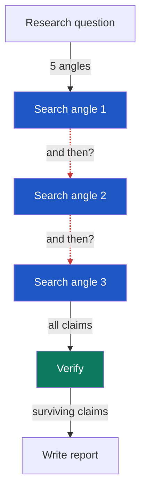
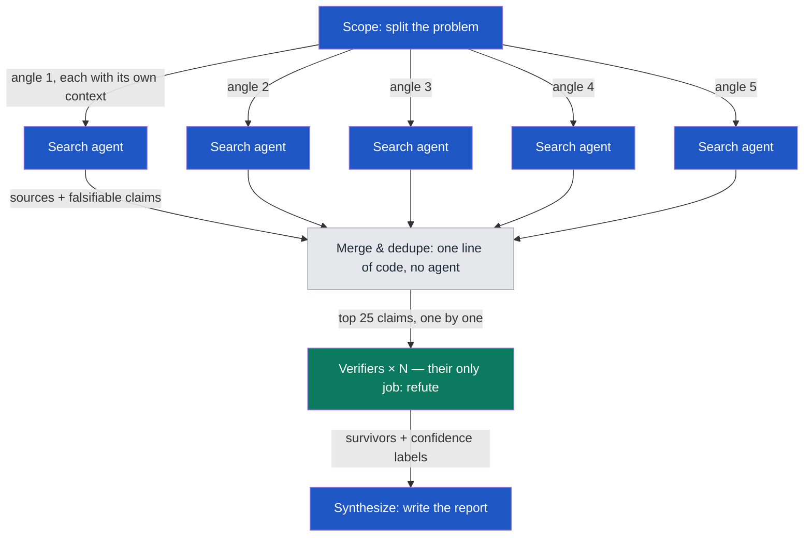
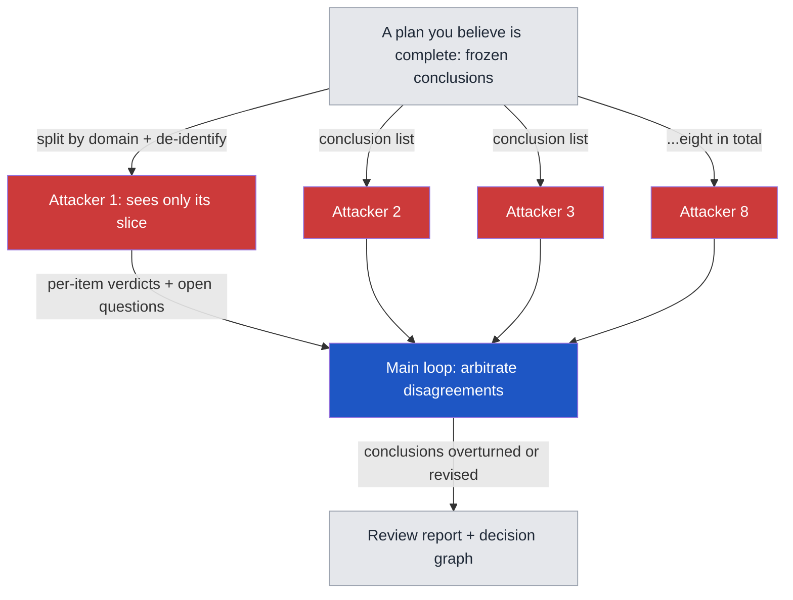
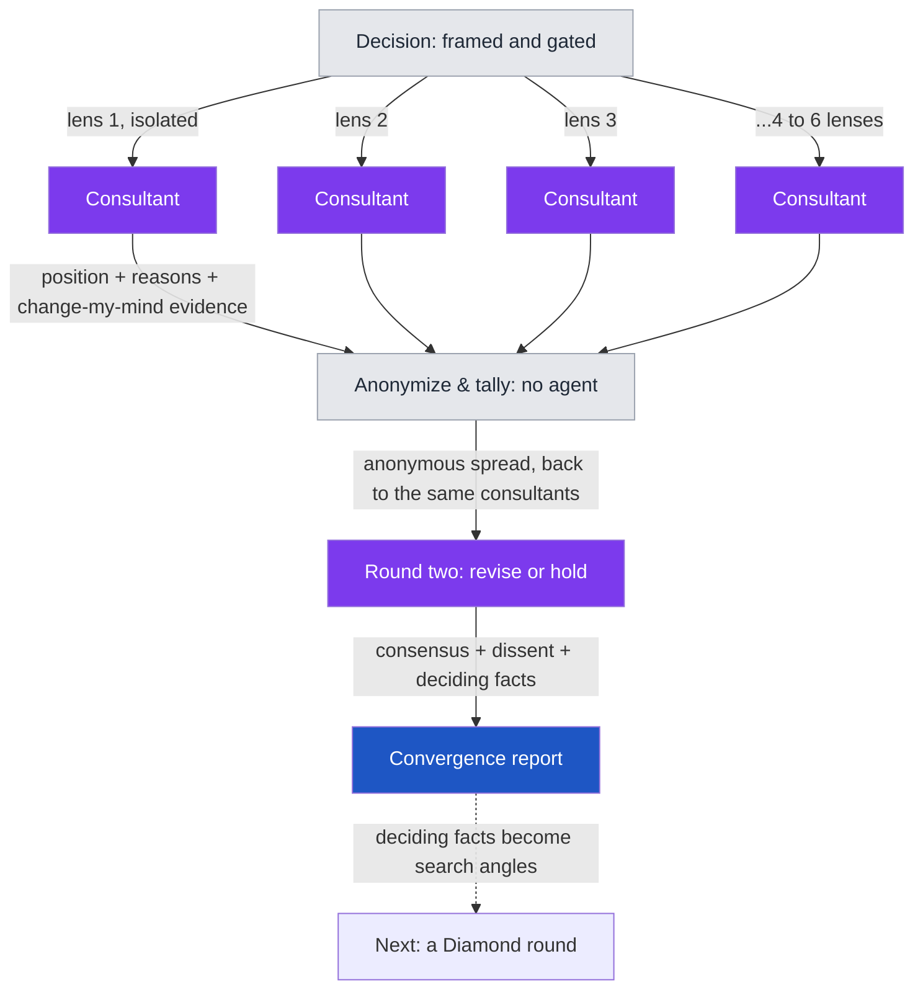

# Graph Engineering Sample Prompts

English ｜ [繁體中文](README.zh-TW.md)

Copy-paste prompts that turn your AI agents from a waiting line into a graph that fires in parallel — then flip the graph around and attack your own conclusions.

Five templates, four diagrams. Every file is self-contained: copy the whole block, paste it to your agent, replace the placeholders, run.

| Template | What it does | When to use it |
|---|---|---|
| [01 False-Edge Audit](prompts/01-false-edge-audit.md) | Lays out your existing workflow and finds which "and then"s are fake | You suspect your agents are waiting in a line they don't need |
| [02 Diamond Research](prompts/02-diamond-research.md) | Split into angles → parallel search → adversarial verification → report with confidence labels | Researching an unknown territory (market, competitors, regulation) |
| [03 Adversarial Review](prompts/03-adversarial-review.md) | Feeds your finished conclusions to isolated attackers | A document that matters, that you've revised many times, that you believe is complete |
| [04 Consultant Roundtable](prompts/04-consultant-roundtable.md) | Two-round Delphi: isolated consultants take positions → anonymous aggregate → revise or hold → consensus map with dissent kept | A decision with no right answer in public data (pricing, timing, build vs buy) |
| [05 Issue Tree](prompts/05-issue-tree.md) | MECE decomposition into a dispatchable tree; fact leaves route to 02, judgment leaves route to 04 | A big fuzzy problem, before any research is dispatched |

## The four diagrams

### Diagram 1: The waiting line (where most people are)

The red dashed lines are false edges: the next step never reads the previous step's output — the order exists only because that's how you typed it. The only test that matters: if you can name the variable flowing along the arrow, the edge is real. If you can't, the two steps are independent and can run at the same time.

### Diagram 2: The diamond (the same work, drawn as a graph)

No edges between the search nodes, so they run simultaneously. The gray node is deterministic code, not an agent — merging and deduping is a one-liner. The green verification layer gets fresh context and has exactly one job: refute.

### Diagram 3: Flip it around (attack your own conclusions)

Same skeleton, opposite direction: the input is not a question but your conclusions, and the middle nodes don't discover — they kill. Field result: a plan hand-revised three times lost roughly one fifth of its conclusions in a single overnight round.

### Diagram 4: The roundtable (judgment, not facts)

Same diamond skeleton, but the middle layer outputs judgment, not facts — and opinions can't be refuted the way claims can, so the fan-in isn't a verification layer. It's a deterministic anonymizer followed by a second pass through the same nodes: consultants see that someone disagrees and why, never who, so revising costs no face. Exactly two rounds — a third manufactures conformity. The dashed edge is the escape hatch back to facts: whatever evidence would settle a disagreement becomes a search angle for a Diamond round.

## Quick start

1. Pick a template, open the file, copy everything below the "Copy this block" line
2. Replace the `[...]` placeholders (your topic / your workflow / your conclusion list)
3. Paste it to your agent

**Harnesses that can spawn subagents** (Claude Code and similar): dispatch in parallel exactly as written — this is where the method shines.

**Plain chat interfaces** (ChatGPT, Claude.ai, Gemini): two fallbacks — (a) open a fresh conversation per role and play the orchestrator yourself, or (b) simulate roles sequentially in one conversation, declaring at each switch "forget the previous role's output; use only your own materials." Isolation degrades, but the method still holds.

## Model assignment

If your harness lets you pick a model per agent, tier by role — this is where quality-per-dollar is won:

| Graph role | Tier | Why | Examples (2026-07 — names age, tiers don't) |
|---|---|---|---|
| Search & fetch nodes | Cheapest fast tier | Repetitive lookup; no judgment needed | Haiku-class / mini-class models |
| Verifiers / attackers | Strong reasoning, mixed families | Refutation is judgment work; at least one verifier from a different model family breaks shared blind spots | Opus 5, GPT-5.5 Terra — plus one from another family |
| Consultants (roundtable) | Strong reasoning, panel spans ≥2 families | Positions are pure judgment; a panel from one family is one opinion in several tones | Same tier as verifiers, deliberately mixed |
| Synthesis / arbitration | The strongest model you have | One context holds everything; an error here survives to the final report | Fable 5, 5.6 Sol, or equivalent |

Field note: running all 313 agents on the top-tier model was expensive tuition — search and fetch never needed it. If you can't pick models per agent (plain chat interfaces), skip this table; the method still works, you just pay more.

## Four honest warnings

- **The token bill is real.** One diamond round can cost tens of single-conversation budgets. Run search and fetch nodes on cheap models; save the judgment for verification and synthesis
- **Multiple copies of the same model share the same blind spots** (Knight & Leveson, 1986, on N-version programming). To break model-level blindness, use a different model family as the counter-examiner
- **The graph buys breadth, not judgment.** A question with zero surviving claims after two rounds has no answer in public data — a hundred more agents won't change that. Go talk to people
- **A persona is a lens, not a credential.** Putting a CFO hat on a model adds zero facts — it changes which risks get looked at first. A consultant panel's value is that its lenses are mutually exclusive, never that its titles sound senior; don't cite a roundtable verdict as if an expert said it

## This method is older than LLMs

Every trick here has a name, and every name predates LLMs by decades: isolated skeptics is the Delphi method (RAND, 1950s) — template 04 runs its two-round anonymous-feedback form in full; designated attack is Devil's Advocacy (management science, 1970s); the open question is the Premortem (Gary Klein, HBR 2007); the rejection ledger is Analysis of Competing Hypotheses (Heuer, CIA); the issue tree and MECE are Barbara Minto's Pyramid Principle discipline (McKinsey, 1960s–70s), which template 05 turns into dispatchable graphs. The method is old. What's new is the price: convening eight experts who never meet went from weeks to an hour.

The full story with field numbers (313 agents, three research rounds, 16–40% rejection rates) is in the companion article (Traditional Chinese, link in the repo description).

## License & Star

MIT. Take it, change it, use it. If these templates saved you a round of rework, a ⭐ helps others find them.
