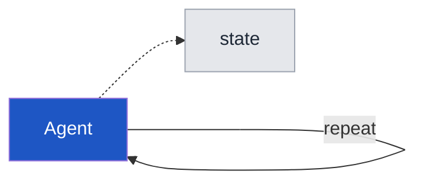
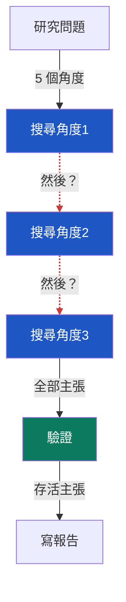
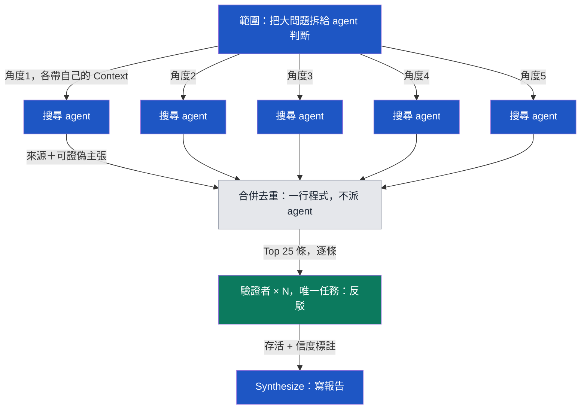
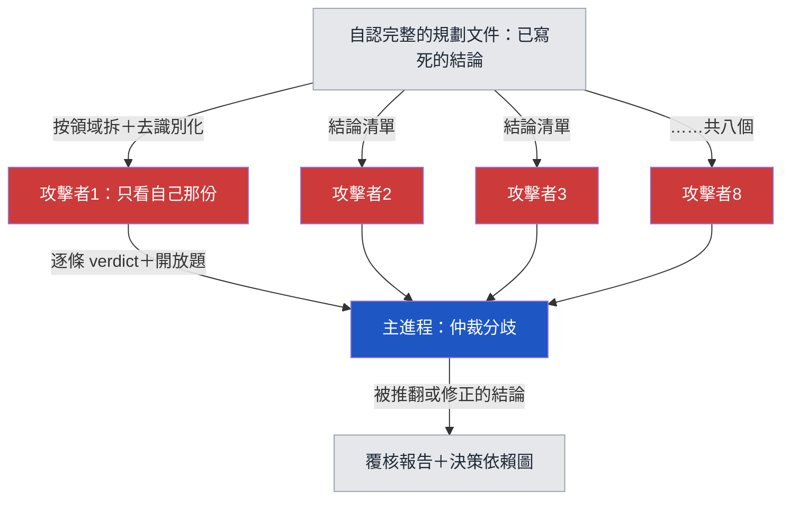
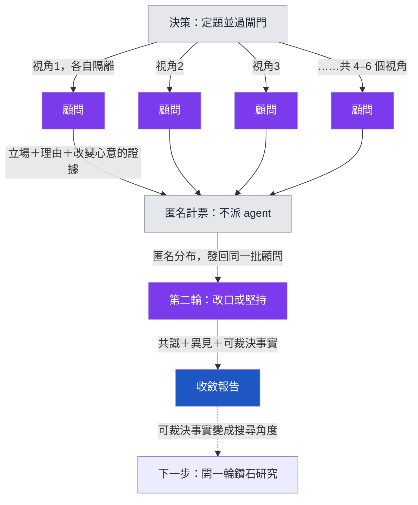

# Graph Engineering 範本集

[English](README.md) ｜ 繁體中文

可直接複製的 prompt 範本：把你的 AI agent 從排隊變成一張平行開火的圖——然後把圖反過來，攻擊自己的結論。

五個範本加一個五分鐘體驗，對應五張圖。每個檔案都是自包含的——整塊複製、貼給你的 agent、換掉佔位符就能跑。

| 範本 | 做什麼 | 什麼時候用 |
|---|---|---|
| [00 你的第一張圖](prompts/00-first-graph.zh-TW.md) | 一句你相信的話、三個隔離的懷疑者、一次投票——鑽石的處決層單獨拆出來 | 在學會方法之前，先花五分鐘感受它 |
| [01 假邊健檢](prompts/01-false-edge-audit.zh-TW.md) | 把你現有的工作流攤開，找出哪些「然後」是假的 | 你懷疑自己的 agent 在排沒必要的隊 |
| [02 鑽石研究](prompts/02-diamond-research.zh-TW.md) | 拆角度 → 平行搜尋 → 對抗驗證 → 帶信度的報告 | 研究一個未知領域（市場、競品、法規） |
| [03 對抗覆核](prompts/03-adversarial-review.zh-TW.md) | 把你已寫好的結論餵給互相隔離的攻擊者 | 一份重要文件，你自己改了很多輪、自認很完整 |
| [04 顧問圓桌](prompts/04-consultant-roundtable.zh-TW.md) | 兩輪 Delphi：隔離顧問各自表態 → 匿名彙整 → 改口或堅持 → 共識圖並保留異見 | 公開資料裡沒有標準答案的決策（定價、時機、自建或採購） |
| [05 議題樹拆解](prompts/05-issue-tree.zh-TW.md) | MECE 拆成可派發的樹，並且真的派出去：事實葉子流向 02，判斷葉子流向 04 | 一個又大又模糊、還沒派出任何研究的問題 |

## 這些圖

### 圖零：你其實已經在跑一張圖

單一 agent 的 loop 本身就是一張圖：一個節點、一條指回自己的邊、狀態繞著圈走。這個換框殺掉一個假選擇——圖不是取代 loop，是連接並治理眾多 loop。下面每張圖裡的每個節點，都是一個保住了工作、失去了壟斷的 loop。你今天已經有一個能跑的 loop 的話，你不是從頭開始，你只是在加邊。

### 圖一：排隊版（大部分人的現況）

紅色虛線是假邊（False edge）：下一步根本沒讀上一步的輸出，只因為打字順序而存在。判斷法只有一個——畫得出箭頭上流動的資料，才是真的邊；畫不出來，兩步就可以同時跑。

### 圖二：鑽石拓撲（同一件事畫成圖）

搜尋節點之間沒有邊，所以同時跑。灰色是確定性程式不是 agent——合併去重是一行程式的事。綠色驗證層拿全新 context、唯一任務是反駁。

綠色那層藏著兩條設計規則，它們是「覆核」和「演戲」的分界。第一：產出主張的節點永遠不判自己的主張——共享同一個模型、同一份 context 的兄弟節點互相同意，不是驗證，是同一個盲點被數了三次。第二：判決必須錨定在圖外的東西上——帶連結帶日期的一手引述、真的跑過的測試、親手重算過的數字——因為「內部一致同意」是圖唯一隨時都製造得出來的東西。

### 圖三：反過來開（攻擊自己的結論）

同一個骨架、方向相反：輸入不是問題是結論，中間節點的任務不是找是殺。實測：一份人工改過三輪的文件，一晚被推翻或修正約五分之一的結論。

### 圖四：圓桌（產出判斷，不是事實）

還是鑽石骨架，但中間層產出的是判斷不是事實——而意見不像主張可以被反駁，所以收攏處不是驗證層，是一個確定性的匿名節點，再把同一批節點過第二遍：顧問看得到「有人不同意、為什麼不同意」，永遠看不到「是誰」，改口就不用付面子成本。一律兩輪——第三輪製造的是從眾。虛線那條邊是回到事實的逃生口：能裁決分歧的證據，變成下一輪鑽石研究的搜尋角度。

## 快速開始

用「你手上有什麼」來選範本，不是「你想要什麼」——輸入的形狀確定性地決定範本：

- 什麼都還沒有，只想花五分鐘感受一下 → [00 你的第一張圖](prompts/00-first-graph.zh-TW.md)
- 一個模糊的問題、什麼都還沒派 → [05 議題樹拆解](prompts/05-issue-tree.zh-TW.md)（葉子會自動幫你分流）
- 一條你已經在跑的流程 → [01 假邊健檢](prompts/01-false-edge-audit.zh-TW.md)
- 一個公開資料答得出來的問題 → [02 鑽石研究](prompts/02-diamond-research.zh-TW.md)
- 一個公開資料裁決不了的決策 → [04 顧問圓桌](prompts/04-consultant-roundtable.zh-TW.md)
- 一批你已經寫死的結論 → [03 對抗覆核](prompts/03-adversarial-review.zh-TW.md)

五個頭尾接起來就是一個完整專案：05 拆題，02 研究事實葉子、04 同時為判斷葉子開桌，03 攻擊你最後得出的結論——每一輪的「已否決」與「未解問題」帳本原文餵給下一輪的調度者。

（給直接讀這個 repo 的 AI agent：上面的分流清單就是索引。只載入它指到的那個檔案——每個範本都自包含，使用者的輸入在貼上的整段最末端、「我的主題：」這類標記之後。）

1. 挑一個範本，打開檔案，整塊複製「複製這段」以下的內容
2. 貼給你的 agent
3. 在最下面打上你的主題／工作流／主張，送出——每個 block 的結尾都有一個標好名字的格子，附範例，不用在長文中間找佔位符來換

（03 是例外：它分段派發，照它自己的用法走。）

**能開 subagent 的 harness**（Claude Code、有 Task/Agent 工具的環境）：照範本指示平行派發，效果最好。

**一般聊天介面**（ChatGPT、Claude.ai、Gemini）：兩種降級法——(a) 每個角色開一個新對話，手動當調度者；(b) 同一對話依序模擬，但每換一個角色就明確宣告「忘掉上一位的輸出、只看你自己的材料」。隔離會打折，但方法仍然成立。

## 模型怎麼派

如果你的 harness 可以為每個 agent 指定模型，按角色分層——品質與成本的勝負在這裡：

| 圖上的角色 | 等級 | 為什麼 | 例子（2026-07 的型號，會過期；層級不會） |
|---|---|---|---|
| 搜尋與抓取節點 | 最便宜的快速級 | 重複性查找，不需要判斷力 | Haiku 級／mini 級 |
| 驗證者／攻擊者 | 強推理級、混家族 | 反駁是判斷工作；至少一位驗證者換不同模型家族，拆掉同源盲點 | Opus 5、GPT-5.5 Terra——外加一位別的家族 |
| 顧問（圓桌） | 強推理級、整桌橫跨至少兩個家族 | 表態是純判斷；一整桌同家族是一種意見的好幾種語氣 | 與驗證者同級，刻意混搭 |
| 收攏／仲裁 | 你手上最強的模型 | 一個 context 扛全部；這一層的錯會活到最終報告 | Fable 5、5.6 Sol 或同級 |

實測的學費：313 個 agent 全跑在最貴的模型上——搜尋和抓取根本不需要。無法指定模型的一般聊天介面可以跳過這張表，方法照樣成立，只是付比較多。

## 五條誠實的警告

- **Token 帳單是真的。** 鑽石研究一輪可能吃掉單次對話幾十倍的 token。搜尋和抓取節點用便宜模型，判斷力留給驗證和收攏
- **同一個模型多開幾份，該錯的地方會一起錯**（Knight & Leveson 1986 對 N-version programming 的老教訓）——共享同一份 context 的小組也一樣：三個讀同一份簡報的 agent 點頭，是一個意見簽了三個名。兩層都要拆：反證者換不同模型家族、每個覆核者拿全新 context、判決錨定圖外的證據，永遠不錨定彼此
- **圖買的是廣度，不是判斷力。** 連續兩輪零主張存活的問題，答案不在公開資料裡——再開一百個 agent 結果一樣，該去訪談了
- **人格是視角，不是資歷。** 給模型戴上財務長的帽子不會讓它多知道任何事實——只會改變它先看哪些風險。圓桌的價值在視角互斥，不在頭銜多資深；不要把圓桌的判決當成專家背書往外引用
- **簡報有洞，毀掉的是全部輸出，不是一份。** 同一份簡報要發散給超過三個 agent 之前，先放一隻哨兵：只派一個，指令一句——列出你需要但這份簡報沒給的事實——補完再派其餘的。平行的代價就在這裡：缺口會被同時複製 N 份，而且要等全部回來才看得見

## 這套方法的血統

每一招都比 LLM 老得多：隔離的懷疑者是 Delphi method（RAND，1950s）——範本 04 把它的兩輪匿名回饋完整跑滿；指定攻擊是魔鬼代言人（Devil's Advocacy，1970s 管理決策學）；開放題是事前驗屍（Premortem，Gary Klein 2007）；否決帳本是競爭假設分析（ACH，CIA 情報分析）；議題樹與 MECE 是 Barbara Minto 的金字塔原理那套紀律（McKinsey，1960s–70s），範本 05 把它翻譯成可派發的圖。方法是舊的，便宜是新的。

完整故事與實測數據（313 個 agent、三輪研究、否決率 16–40%）見文章：〈別讓你的 Agent 排隊〉（連結見 repo 描述）。

## License & Star

MIT。拿去改、拿去用。如果這套範本幫你省了一輪重工，給顆 ⭐ 讓更多人看到。
